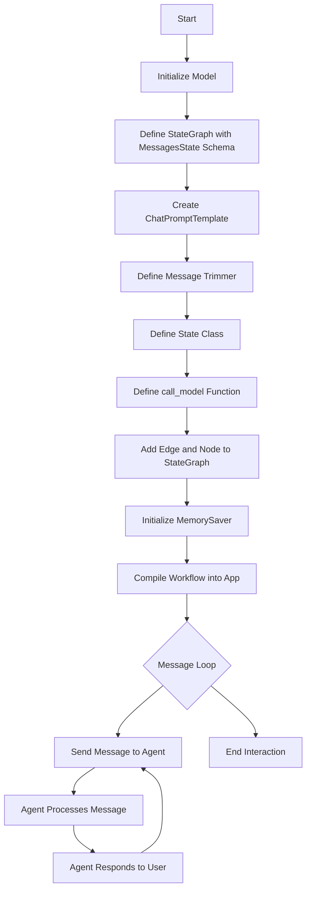

# A chatbot with LangChain

The objective of this project is to build a basic chatbot using LangChain. This chatbot needs to have memory

```mermaid
flowchart TD
    A[Start] --> B[Initialize Model]
    B --> C[Define StateGraph with MessagesState Schema]
    C --> D[Create ChatPromptTemplate]
    D --> E[Define Message Trimmer]
    E --> F[Define State Class]
    F --> G[Define call_model Function]
    G --> H[Add Edge and Node to StateGraph]
    H --> I[Initialize MemorySaver]
    I --> J[Compile Workflow into App]
    J --> K{Message Loop};
    K --> M[Send Message to Agent];
    M --> N[Agent Processes Message];
    N --> O[Agent Responds to User];
    O --> M
    K --> P[End Interaction]
```