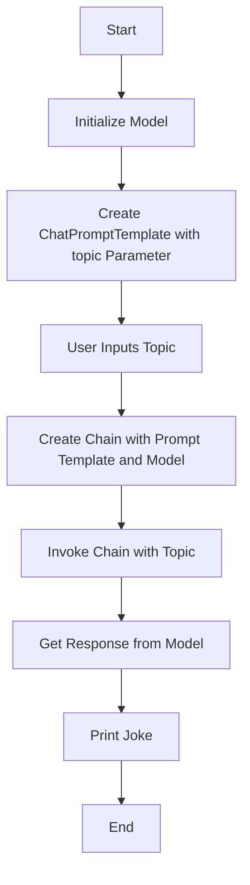

# Joker using LangChain

The objective of this project is to build a joke generator using LangChain.

```mermaid
flowchart TD
    A[Start] --> B[Initialize Model]
    B --> C[Create ChatPromptTemplate with topic Parameter]
    C --> D[User Inputs Topic]
    D --> E[Create Chain with Prompt Template and Model]
    E --> F[Invoke Chain with Topic]
    F --> G[Get Response from Model]
    G --> H[Print Joke]
    H --> I[End]
```
