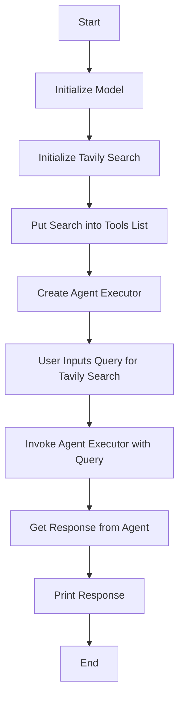

# Search using Tavily and Agent in LangChain

The objective of this project is to build a Agente that uses Tavily Search to get the answers when its needed.

```mermaid
flowchart TD
    A[Start] --> B[Initialize Model]
    B --> C[Initialize Tavily Search]
    C --> D[Put Search into Tools List]
    D --> E[Create Agent Executor]
    E --> F[User Inputs Query for Tavily Search]
    F --> G[Invoke Agent Executor with Query]
    G --> H[Get Response from Agent]
    H --> I[Print Response]
    I --> J[End]
```