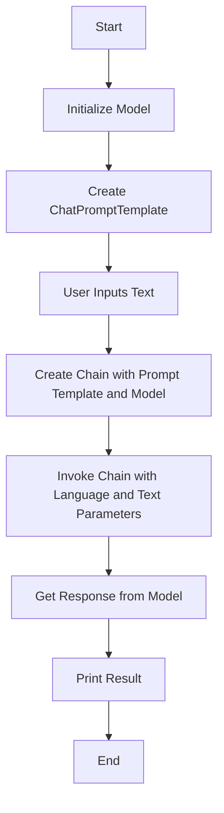

# Simple translator using LangChain

The objective of this project is to build a translator using LangChain.

```mermaid
flowchart TD
    A[Start] --> C[Initialize Model]
    C --> D[Create ChatPromptTemplate]
    D --> E[User Inputs Text]
    E --> F[Create Chain with Prompt Template and Model]
    F --> G[Invoke Chain with Language and Text Parameters]
    G --> H[Get Response from Model]
    H --> I[Print Result]
    I --> J[End]
```
