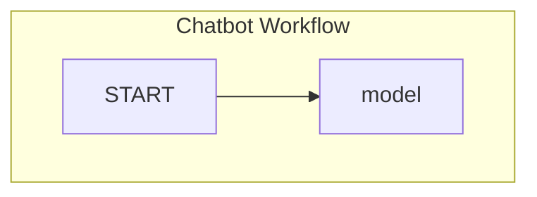

# "Chatbot Workflow with OpenAI Model Integration and Memory Saver"

## Objective
The objective of this code is to create a chatbot workflow that integrates an OpenAI model for generating responses and utilizes a memory saver to store the conversation history.

## Summary of the Objective:
- Create a chatbot workflow with an integrated OpenAI model.
- Implement a memory saver to store the conversation history.

# Flowchart
