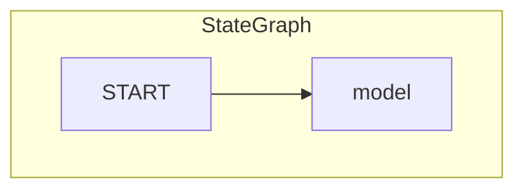

# Chatbot Interaction with OpenAI Model and Memory Saver

## Objective
The objective of this code is to create a chatbot interaction using the OpenAI model and a memory saver to store the conversation history.

## Summary of the Objective:
- Create a chatbot interaction using the OpenAI model.
- Implement a memory saver to store the conversation history.

# Flowchart
