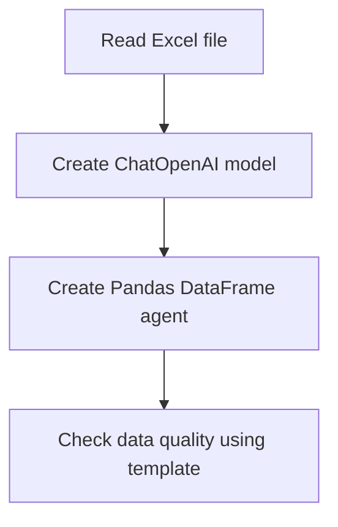

## Objective
The objective of this code is to perform a data quality check using ChatOpenAI and a Pandas DataFrame.

## Summary of the Objective:
- Read an Excel file containing data on the composition of petroleum derivatives.
- Use ChatOpenAI to create a Pandas DataFrame agent for checking data quality.

# Flowchart
