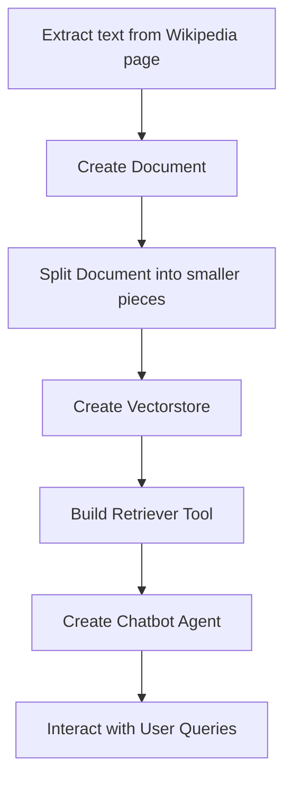

# "Climate Change Wikipedia Chatbot"

## Objective
The objective of this code is to create a chatbot that retrieves information from the Wikipedia page on climate change and provides conversational responses to user queries.

## Summary of the Objective:
- Extract text from the Wikipedia page on climate change
- Split the text into smaller pieces
- Create a vector store from the text
- Build a retriever tool to search and return excerpts from the Wikipedia page
- Create a chatbot agent to interactively respond to user queries

# Flowchart
