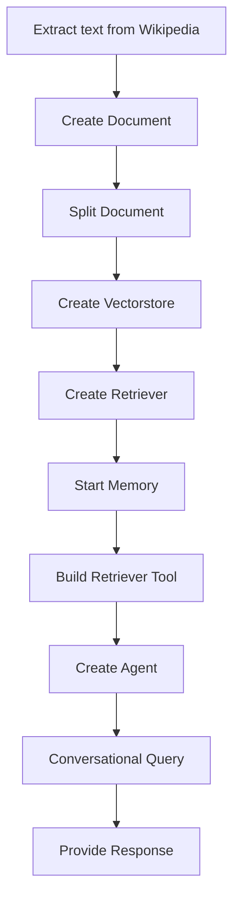

# Climate Change Wikipedia Chatbot

## Objective
The objective of this code is to create a chatbot that retrieves information from the Wikipedia page on climate change and provides conversational responses to user queries.

## Summary of the Objective:
- Extract text from the Wikipedia page on climate change.
- Split the text into smaller pieces for processing.

# Flowchart
