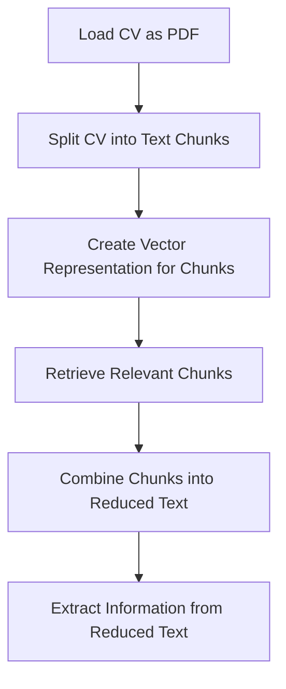

# Python Code for Candidate Information Extraction and Analysis

## Objective
The objective of this code is to extract relevant information from a candidate's CV using natural language processing techniques and then analyze the extracted information.

## Summary of the Objective:
- Extract relevant information from a candidate's CV using NLP techniques.
- Analyze the extracted information to understand the candidate's qualifications and experience.

## Medium tutorial
[Click here](https://patotricks15.medium.com/generative-ai-project-python-langchain-cv-analyzer-c56f07c7f1f0)

# Flowchart

