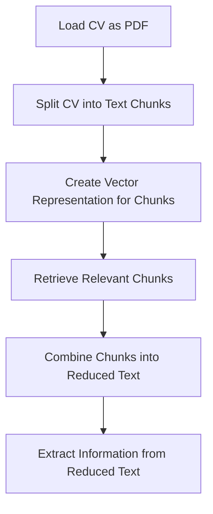

# Python Code for Candidate Information Extraction and Analysis

## Objective
The objective of this code is to extract relevant information from a candidate's CV using natural language processing techniques and then analyze the extracted information.

## Summary of the Objective:
- Extract relevant information from a candidate's CV using NLP techniques.
- Analyze the extracted information to understand the candidate's qualifications and experience.

# Flowchart

The Python code performs the following tasks:
1. Loads the candidate's CV as a PDF.
2. Splits the CV into text chunks.
3. Creates a vector representation for the text chunks.
4. Retrieves relevant chunks based on specific queries.
5. Combines the relevant chunks into a reduced text.
6. Extracts information from the reduced text using a chat prompt template and OpenAI model.

The extracted information includes the candidate's name, main job role, total years of experience, bachelor's degree, years of experience working with Python, GitHub URL, LinkedIn URL, and years of experience working on machine learning projects.

The code uses various libraries and modules such as langchain, langchain_openai, langchain_core, pydantic, dotenv, and os to achieve the objective. The flowchart illustrates the sequential steps involved in the process.

The README has been generated based on the provided Python code.