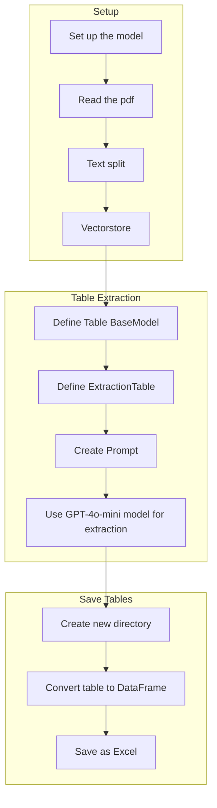

# Table Extraction from PDFs using GPT-4o-mini Model

## Objective
The objective of this code is to extract tables from PDF documents using the GPT-4o-mini model and save the extracted tables as Excel files.

## Summary of the Objective:
- Set up the GPT-4o-mini model for table extraction
- Read the PDF document
- Split the text into semantic chunks
- Create a vector store for the documents
- Define a class for the table and table extraction
- Use the GPT-4o-mini model to extract tables from the text
- Save the extracted tables as Excel files

## Medium tutorial
[Click here](https://patotricks15.medium.com/generative-ai-project-extracting-pandas-dataframes-from-scientific-papers-8f38b07bee9b)

# Flowchart

The Python code performs the following tasks:
1. Sets up the GPT-4o-mini model for table extraction
2. Reads the PDF document
3. Splits the text into semantic chunks
4. Creates a vector store for the documents
5. Defines the Table BaseModel and ExtractionTable
6. Creates a prompt for table extraction
7. Uses the GPT-4o-mini model to extract tables from the text
8. Saves the extracted tables as Excel files
