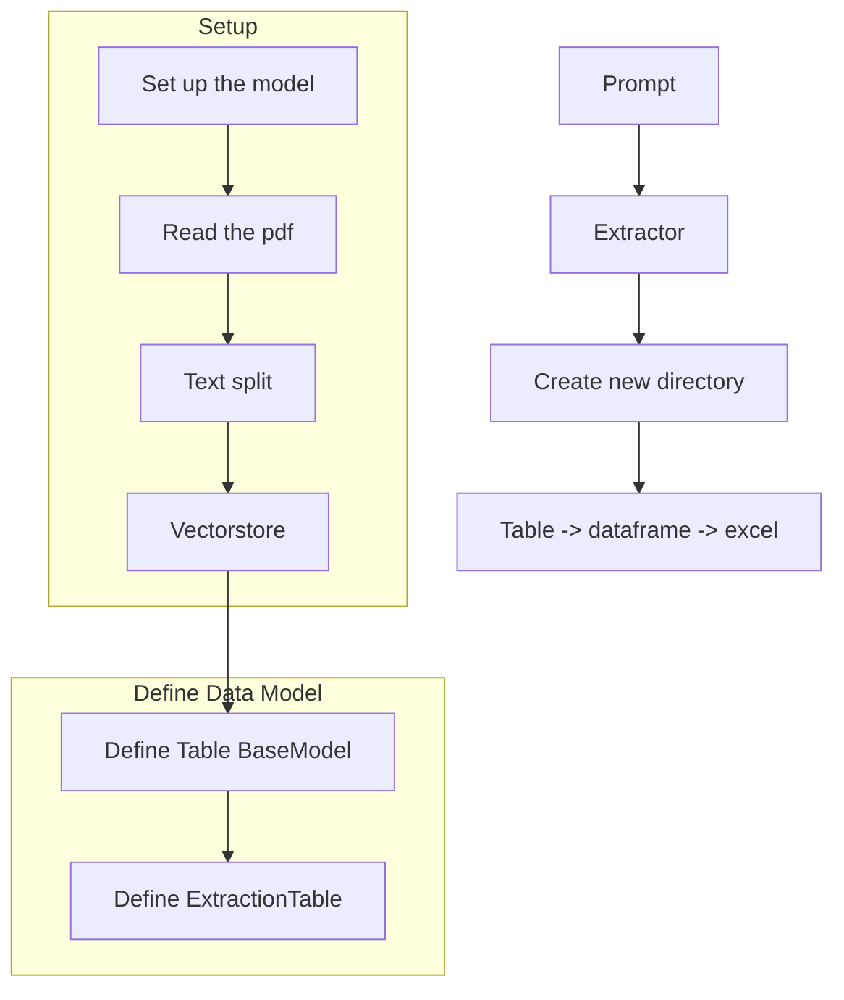

# Table Extraction from PDFs using GPT-4o-mini Model

## Objective
The objective of this code is to extract tables from PDF documents using the GPT-4o-mini model and save the extracted tables as Excel files.

## Summary of the Objective:
- Set up the GPT-4o-mini model for table extraction from PDFs.
- Read the PDF document and split the text.
- Create a vector store for the text and set up a retriever.
- Define a data model for the extracted tables.
- Use the GPT-4o-mini model to extract tables from the text.
- Save the extracted tables as Excel files.

# Flowchart

The code begins by setting up the GPT-4o-mini model for table extraction from PDFs. It then reads the PDF document, splits the text, and creates a vector store for the text. Next, it defines the data model for the extracted tables and uses the GPT-4o-mini model to extract tables from the text. Finally, it saves the extracted tables as Excel files.