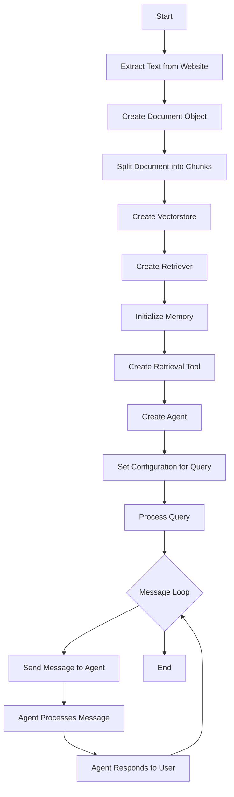

# Website chatbot LangChain

The objective of this project is to build a chatbot using LangChain to chat with any website content.

```mermaid
graph TD;
    A[Start] --> B[Extract Text from Website];
    B --> C[Create Document Object];
    C --> D[Split Document into Chunks];
    D --> E[Create Vectorstore];
    E --> F[Create Retriever];
    F --> G[Initialize Memory];
    G --> H[Create Retrieval Tool];
    H --> I[Create Agent];
    I --> J[Set Configuration for Query];
    J --> K[Process Query];
    K --> L{Message Loop};
    L --> M[Send Message to Agent];
    M --> N[Agent Processes Message];
    N --> O[Agent Responds to User];
    O --> L;
    L --> P[End]
```
