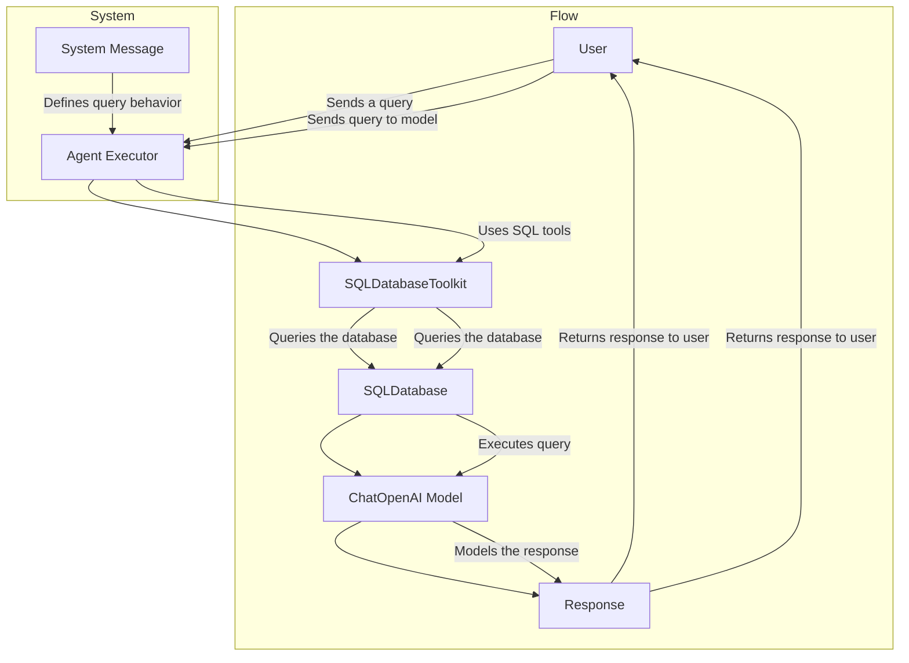

# Question answering SQL database using Langchain

This project use the Chinook.db to develop the Q&A System

```mermaid
    graph TD
        A[User] -->|Sends a query| B[Agent Executor]
        B --> C[SQLDatabaseToolkit]
        C -->|Queries the database| D[SQLDatabase]
        D --> E[ChatOpenAI Model]
        E --> F[Response]
        F -->|Returns response to user| A

        subgraph System
            direction TB
            SQL_PREFIX[System Message]
            SQL_PREFIX -->|Defines query behavior| B
        end

        subgraph Flow
            direction TB
            A -->|Sends query to model| B
            B -->|Uses SQL tools| C
            C -->|Queries the database| D
            D -->|Executes query| E
            E -->|Models the response| F
            F -->|Returns response to user| A
        end
```