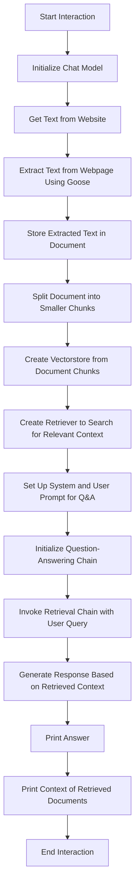

# Talking to a website in LangChain

The objective of this project is to build a RAG to answer questions about a website content.

```mermaid
flowchart TD
    A[Start Interaction] --> B[Initialize Chat Model]
    B --> C[Get Text from Website]
    C --> D[Extract Text from Webpage Using Goose]
    D --> E[Store Extracted Text in Document]
    E --> F[Split Document into Smaller Chunks]
    F --> G[Create Vectorstore from Document Chunks]
    G --> H[Create Retriever to Search for Relevant Context]
    H --> I[Set Up System and User Prompt for Q&A]
    I --> J[Initialize Question-Answering Chain]
    J --> K[Invoke Retrieval Chain with User Query]
    K --> L[Generate Response Based on Retrieved Context]
    L --> M[Print Answer]
    M --> N[Print Context of Retrieved Documents]
    N --> O[End Interaction]
```
