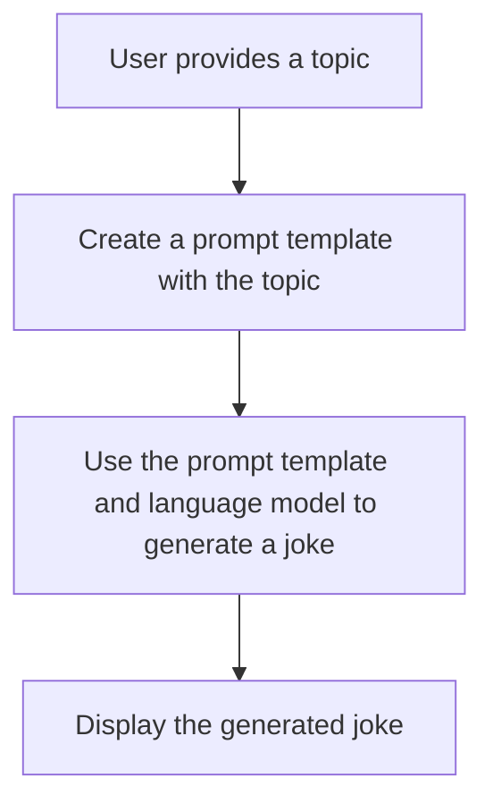

# "Interactive Joke Generator with OpenAI Language Model"

## Objective
The objective of this code is to create an interactive joke generator using the OpenAI Language Model. The user provides a topic, and the code uses the model to generate a joke related to the given topic.

## Summary of the Objective:
- Set up the configurations for the OpenAI Language Model.
- Create a prompt template for generating jokes based on user input topics.
- Use the prompt template and the language model to generate a joke based on the user-provided topic.

# Flowchart
