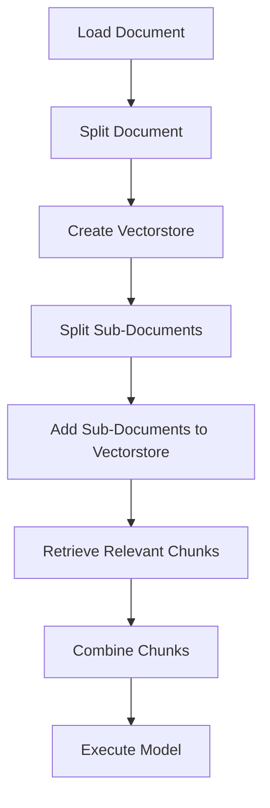

# "NIKE, Inc. Executive Data Extraction and Analysis"

## Objective
The objective of this code is to extract relevant data about executive officers from documents related to NIKE, Inc and analyze the extracted information.

## Summary of the Objective:
- Extract data about executive officers from NIKE, Inc documents
- Analyze the extracted data to obtain information such as executive names, job positions, age, sector/field within NIKE, Inc, start date at NIKE, Inc, and gender

# Flowchart


The code begins by loading the document from a specified file path and then splitting the document into chunks. It creates a vectorstore and splits the sub-documents, adding them to the vectorstore. It then retrieves relevant chunks, combines them, and executes the model to extract and analyze the data.

The code utilizes various libraries and modules such as langchain_chroma, langchain_openai, langchain_text_splitters, langchain_core, langchain_community, pydantic, and uuid to achieve the objective.

The extracted data is structured using the `Executive` class, and a prompt is created to guide the extraction process. Relevant chunks are obtained using queries related to executive information, and the model is executed to obtain the final result.

The result of the model execution is printed at the end of the code.

Overall, the code demonstrates the extraction and analysis of executive data from NIKE, Inc documents using a structured approach.

```python
from langchain_chroma import Chroma
from langchain_openai import OpenAIEmbeddings
from langchain_text_splitters import RecursiveCharacterTextSplitter, TokenTextSplitter
from langchain_openai import ChatOpenAI
from langchain_core.prompts import ChatPromptTemplate
from typing import Optional, List
from pydantic import BaseModel, Field
from langchain_community.document_loaders import PyPDFLoader
from langchain.storage import InMemoryByteStore
from langchain.retrievers.multi_vector import MultiVectorRetriever
import uuid

# ... [Truncated for brevity] ...
```