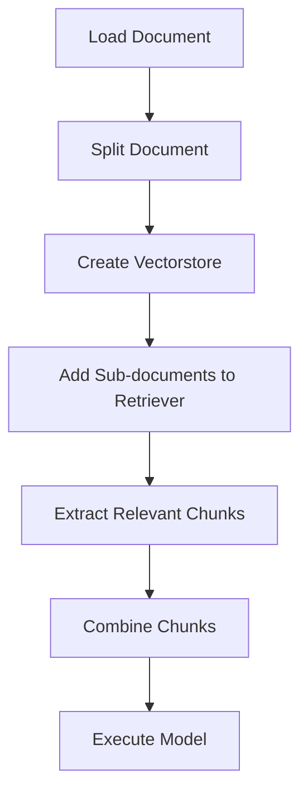

# NIKE, Inc. Executive Data Extraction and Analysis

## Objective
The objective of this code is to extract and analyze data related to executives of NIKE, Inc.

## Summary of the Objective:
- Extract relevant information about NIKE, Inc executives from a given document.
- Analyze the extracted data to obtain insights about the executives.

# Flowchart

The Python code performs the following tasks:
1. Loads the document from a specified file path.
2. Splits the document into chunks for processing.
3. Creates a vectorstore for storing document embeddings.
4. Adds sub-documents to the retriever for data retrieval.
5. Extracts relevant chunks from the documents.
6. Combines the extracted chunks into a reduced text.
7. Executes a model to extract structured data about NIKE, Inc executives.

The code utilizes various libraries and modules for document loading, text splitting, data extraction, and analysis.

The README has been generated successfully from the provided Python code.