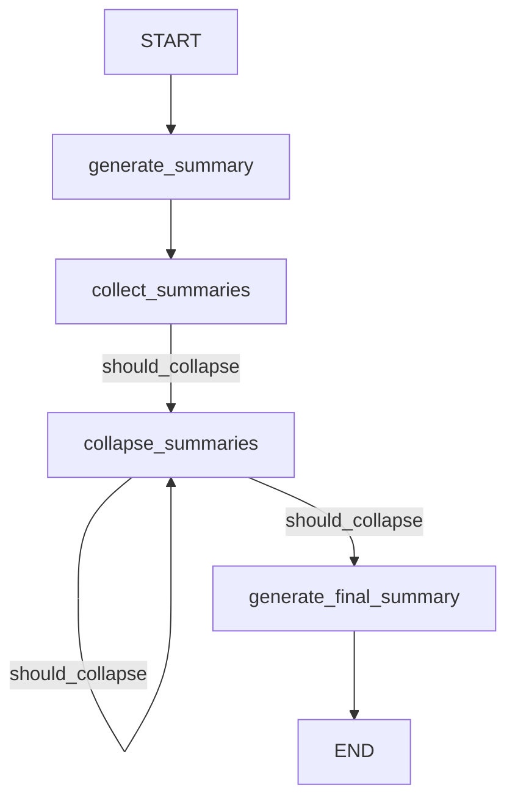

# Orchestrating Summarization Using Langgraph

## Objective
The objective of this code is to orchestrate the summarization of a set of documents using Langgraph. It involves splitting the documents, generating individual summaries, collapsing the summaries, and generating a final consolidated summary.

## Summary of the Objective:
- Load a set of documents and split them into smaller chunks for processing.
- Generate individual summaries for each chunk of the documents.
- Collapse the individual summaries into a consolidated set of summaries.
- Generate a final, consolidated summary of the main themes from the collapsed summaries.

# Flowchart
