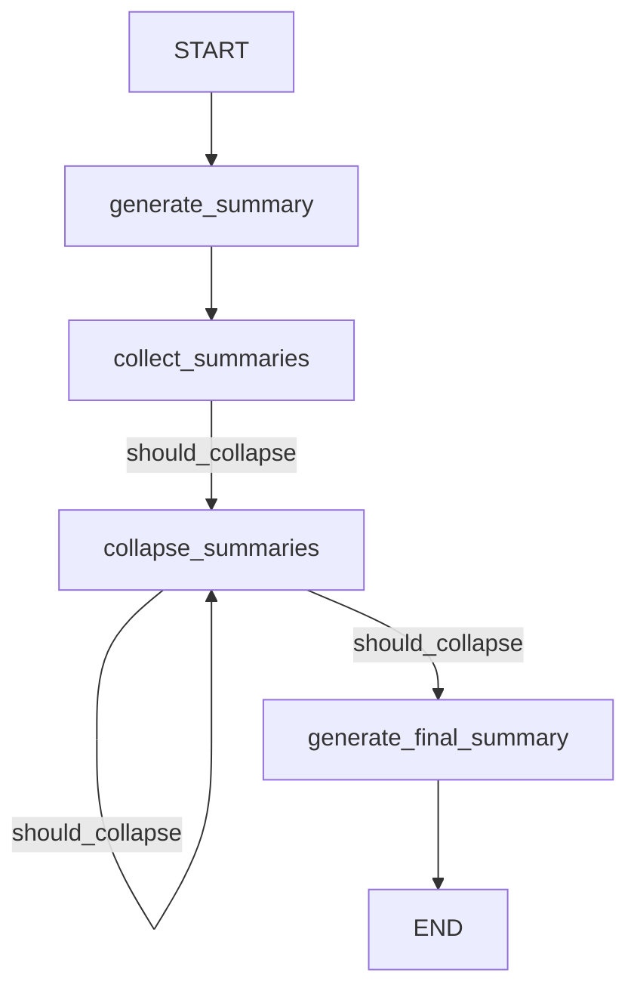

# "Orchestrating Summarization Using Langgraph"

## Objective
The objective of this code is to orchestrate the summarization process using Langgraph, which involves splitting documents, generating summaries, collapsing the summaries, and producing a final consolidated summary.

## Summary of the Objective:
- The code uses Langgraph to split the input documents, generate individual summaries, collapse the summaries, and produce a final consolidated summary.
- It utilizes various components such as document loaders, text splitters, OpenAI model, and Langgraph to achieve the orchestration of the summarization process.

# Flowchart
