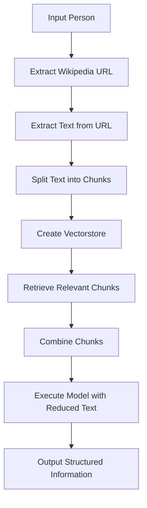

# Text Extraction and Structured Information Retrieval for Wikipedia Person Profiles

## Objective
The objective of this code is to extract relevant information from Wikipedia person profiles and retrieve structured information such as the person's name, birth year, and height in meters.

## Summary of the Objective:
- Extract relevant information from Wikipedia person profiles.
- Retrieve structured information such as the person's name, birth year, and height in meters.

# Flowchart

The Python code performs the following tasks:
1. Imports necessary modules and packages.
2. Prompts the user to input a person's name and constructs the Wikipedia URL for the person's profile.
3. Extracts the text content from the Wikipedia URL and creates a document object.
4. Splits the text into chunks for processing.
5. Creates a vectorstore and retrieves relevant chunks using similarity search.
6. Defines a structured output class for the extracted information.
7. Defines a prompt and model for structured information extraction.
8. Defines a function to retrieve relevant chunks for specific queries.
9. Executes the model with the reduced text and outputs the structured information.

The code uses various language processing and information retrieval techniques to extract and structure information from Wikipedia person profiles.