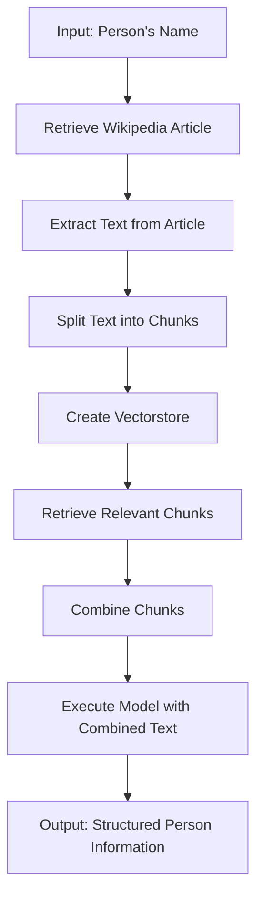

# "Person Information Extraction and Structured Output from Text"

## Objective
The objective of this code is to extract relevant information about a person from a given text, such as the person's name, birth year, and height in meters. The code uses language processing and AI models to extract and structure the information.

## Summary of the Objective:
- Extract relevant information about a person from a given text.
- Structure the extracted information into a predefined format.

# Flowchart

The code begins by taking the input of the person's name. It then retrieves the Wikipedia article related to the person and extracts the text from the article. The text is split into chunks, and a vectorstore is created. Relevant chunks are retrieved, combined, and then used as input for the model execution. Finally, the output is the structured information about the person.

The README has been generated based on the provided Python code.