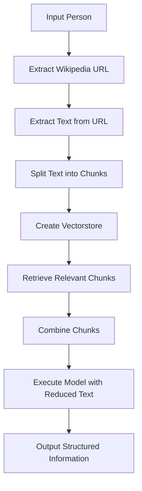

# Text Extraction and Structured Information Retrieval for Wikipedia Person Profiles

## Objective
The objective of this code is to extract relevant information from Wikipedia person profiles and retrieve structured information such as the person's name, birth year, and height in meters.

## Summary of the Objective:
- Extract relevant information from Wikipedia person profiles.
- Retrieve structured information such as the person's name, birth year, and height in meters.

## Medium tutorial:
[Click here](https://patotricks15.medium.com/generative-ai-project-extracting-personalinformation-from-wikipedia-using-langchain-9dceefddedfe)

# Flowchart

