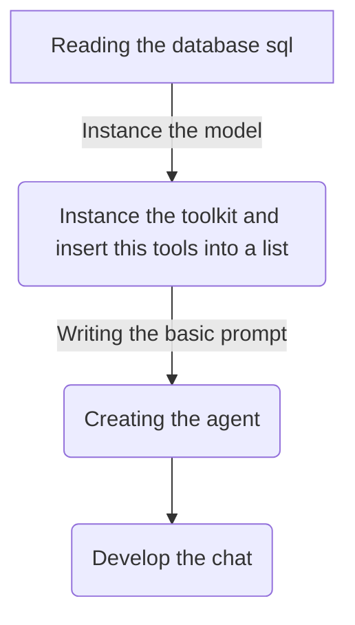

# Agent for Interacting with SQL Database Using ChatOpenAI

## Objective
The objective of this code is to create an agent that interacts with an SQL database using ChatOpenAI to execute syntactically correct SQLite queries based on user input and return the results.

## Summary of the Objective:
- Create an agent that interacts with an SQL database using ChatOpenAI.
- Execute syntactically correct SQLite queries based on user input and return the results.

# Flowchart

The provided Python code initializes an SQL database, creates a ChatOpenAI model, and develops an agent to interact with the database. The agent executes syntactically correct SQLite queries based on user input and returns the results. The flowchart illustrates the sequence of steps involved in the code execution.