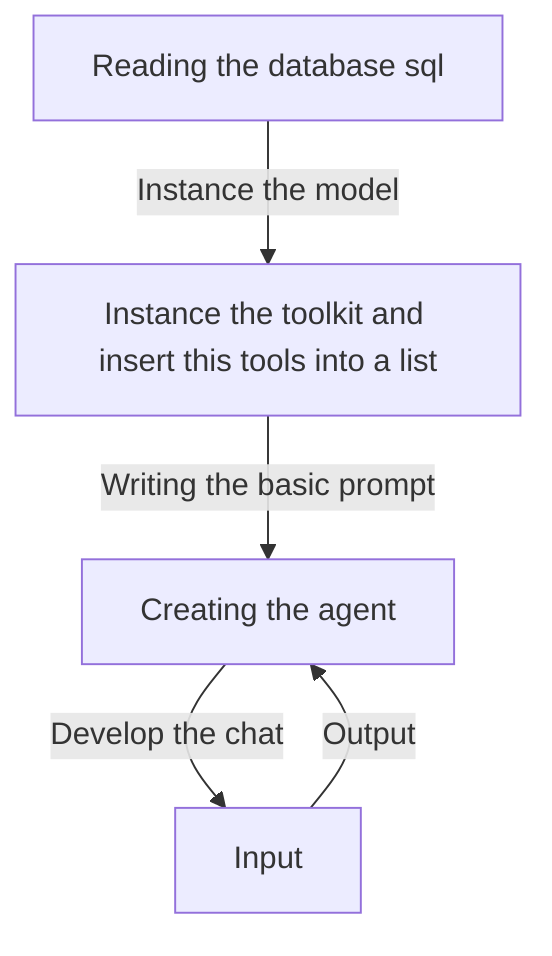

# Agent for Interacting with a SQL Database Using Chat OpenAI

## Objective
The objective of this code is to create an agent that interacts with a SQL database using Chat OpenAI. The agent is designed to take input questions, create syntactically correct SQLite queries, run the queries, and return the results. It uses a combination of SQLDatabaseToolkit, ChatOpenAI, and OpenAIEmbeddings to achieve this functionality.

## Summary of the Objective:
- Create an agent that interacts with a SQL database
- Use Chat OpenAI to generate syntactically correct SQLite queries based on input questions

# Flowchart

The README has been generated based on the provided Python code.