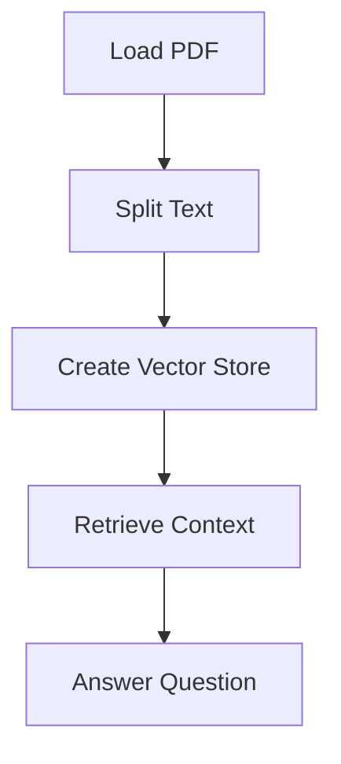

# "AI Question-Answering System for Nike's Financial Reports"

## Objective
The objective of this AI question-answering system is to retrieve and analyze financial data from Nike's financial reports and provide concise answers to specific questions related to Nike's revenue and other financial metrics.

## Summary of the Objective:
- Retrieve financial data from Nike's financial reports.
- Use the retrieved data to answer specific questions related to Nike's revenue and other financial metrics.

# Flowchart

The Python code initializes a question-answering system for Nike's financial reports. It loads a PDF file containing the financial reports, splits the text, creates a vector store, retrieves context, and answers specific questions related to Nike's revenue and other financial metrics. The system uses the OpenAI GPT-3.5 model for question-answering tasks.