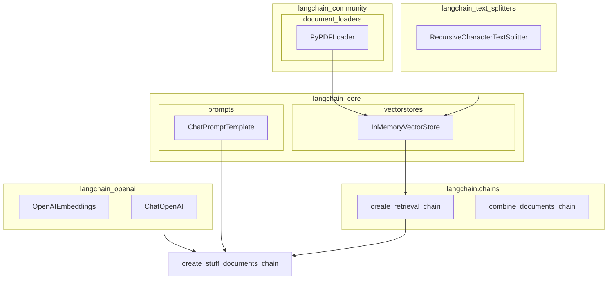

# AI-Powered Question Answering System for Nike's Financial Reports

## Objective
The objective of this AI-powered system is to use language processing and AI models to answer questions related to Nike's financial reports.

## Summary of the Objective:
- Use PyPDFLoader to load Nike's financial reports in PDF format.
- Split the documents into chunks, create a retrieval chain, and use an AI model to answer questions related to Nike's financial data.

# Flowchart
