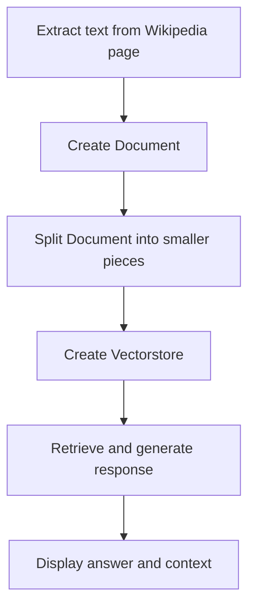

# Question-Answering System for Climate Change Wikipedia Page

## Objective
The objective of this code is to create a question-answering system for the Wikipedia page on climate change using language processing and retrieval techniques.

## Summary of the Objective:
- Extract text from the Wikipedia page on climate change.
- Split the text into smaller pieces and create a vectorstore for language processing and retrieval.
- Use the vectorstore to retrieve and generate responses to user queries.

# Flowchart
