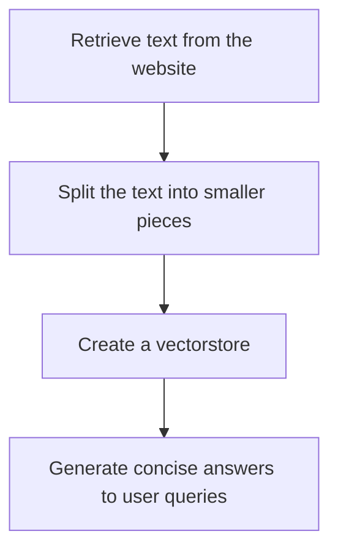

# "Question-Answering Assistant for Climate Change"

## Objective
The objective of this code is to create a question-answering assistant for climate change by retrieving information from a given website and generating concise answers to user queries.

## Summary of the Objective:
- Retrieve text from a website related to climate change.
- Split the text into smaller pieces, create a vectorstore, and generate concise answers to user queries.

# Flowchart
