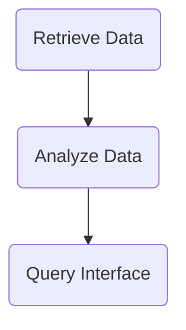

# Population Data Analysis and Querying Tool

## Objective
The objective of this tool is to retrieve population data for specific countries and time periods, analyze the data, and provide a querying interface to obtain information about the population.

## Summary of the Objective:
- Retrieve population data for Brazil and the United States from 2000 to 2022
- Analyze the data and provide a querying interface to obtain information about the population

# Flowchart

---

The Python code retrieves population data for Brazil and the United States from 2000 to 2022 using the World Bank API. It then creates a querying interface to obtain information about the population.

The code uses the `wbdata` library to retrieve the population data and the `langchain_openai` and `langchain_experimental` libraries to create a querying interface. The retrieved data is displayed, and the querying interface is used to find the country with the highest population and provide a complete sentence with numbers.

The querying interface is created using the OpenAI GPT-3.5 model and allows users to ask questions about the population data.

To run the code, ensure that the required libraries are installed and execute the provided Python script.