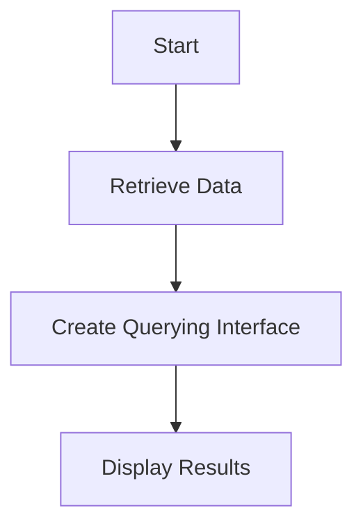

# "Population Data Analysis and Querying Tool"

## Objective
The objective of this tool is to retrieve population data for specific countries and time periods, analyze the data, and provide a querying interface to obtain information about the population.

## Summary of the Objective:
- Retrieve population data for Brazil and the United States from 2000 to 2022.
- Analyze the population data and provide a querying interface to obtain information about the population.

# Flowchart

The README has been generated based on the provided Python code.