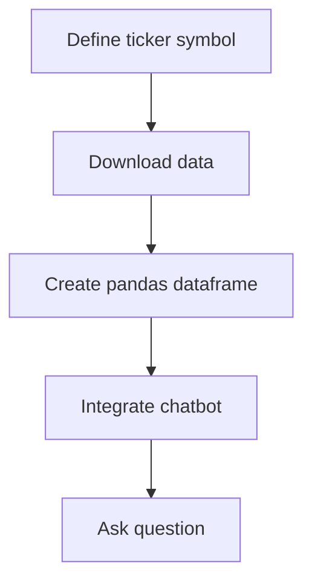

# "Stock Data Analysis with Chatbot Integration"

## Objective
The objective of this code is to demonstrate how to use the yfinance library to download historical stock data, create a pandas dataframe, and integrate a chatbot to interact with the data.

## Summary of the Objective:
- Download historical stock data using the yfinance library.
- Create a pandas dataframe from the downloaded data.
- Integrate a chatbot to interact with the stock data.

# Flowchart

The README has been generated based on the provided Python code.