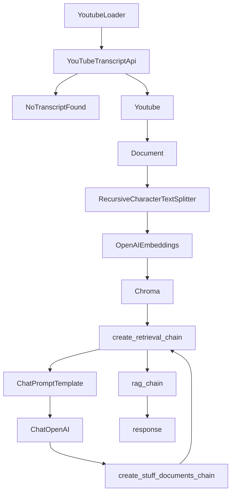

# Youtube Video Text Extraction and Question-Answering with Generative AI

## Objective
The objective of this code is to extract text from YouTube videos related to generative AI and RAG (Retrieval-Augmented Generation) and perform question-answering using generative AI models.

## Summary of the Objective:
- Extract text from YouTube videos related to generative AI and RAG.
- Use generative AI models to perform question-answering based on the extracted text.

# Flowchart

The Python code provided performs the following tasks:

1. It extracts text from YouTube videos related to generative AI and RAG.
2. It processes the extracted text using various language processing modules such as OpenAIEmbeddings and Chroma.
3. It sets up a question-answering chain using generative AI models and retrieves answers based on user queries.

The code uses the langchain_community, youtube_transcript_api, langchain_chroma, langchain_openai, langchain_text_splitters, langchain, and langchain_core libraries to achieve the objective.

The flowchart illustrates the sequence of operations involved in the code, including the modules and libraries used for text extraction and question-answering.

The code interacts with the user by prompting for a text input and then providing an answer based on the question-answering chain.

The README provides an overview of the code's objective, a summary of the tasks performed, and a flowchart depicting the sequence of operations.