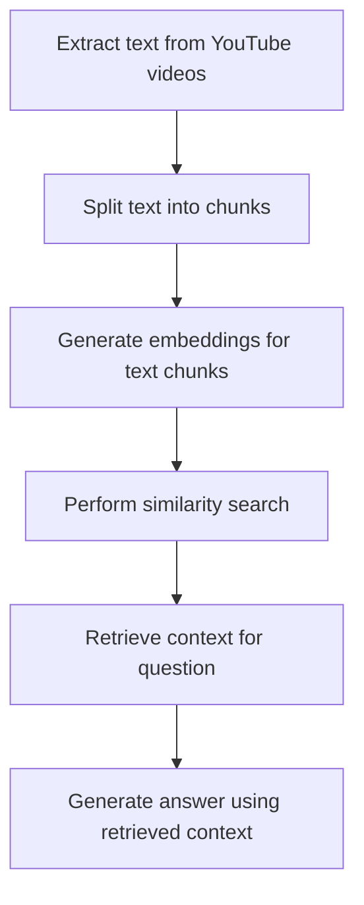

# "Question-Answering System for Generative AI and RAG Videos"

## Objective
The objective of this code is to create a question-answering system for generative AI and RAG (Retrieval-Augmented Generation) videos. The system retrieves context from a collection of videos and uses it to answer user questions.

## Summary of the Objective:
- Extract text from a collection of YouTube videos related to generative AI and RAG.
- Create a question-answering system that uses the extracted text to answer user questions.

# Flowchart

The Python code initializes a question-answering system for generative AI and RAG videos. It extracts text from a collection of YouTube videos, splits the text into chunks, generates embeddings for the text chunks, performs a similarity search, retrieves context for a given question, and generates an answer using the retrieved context.

The code uses various libraries and modules such as `langchain_community`, `youtube_transcript_api`, `langchain_chroma`, `langchain_openai`, `langchain_text_splitters`, `langchain_core`, and `langchain.docstore`. It also interacts with the YouTube API to extract video transcripts and uses OpenAI's GPT-3.5 model for question answering.

The system prompts the user to input a question and then generates an answer based on the retrieved context from the videos.

The code is structured and well-documented, making it easy to understand and modify for future enhancements.