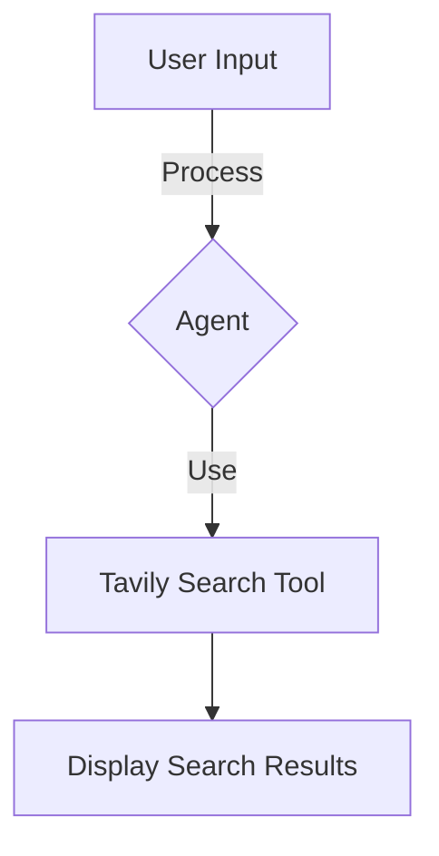

# "Interactive Tavily Search Agent with Language Processing"

## Objective
The objective of this code is to create an interactive Tavily search agent using language processing. The agent uses the OpenAI GPT-3.5 model to process user input and then utilizes the Tavily search tool to provide search results.

## Summary of the Objective:
- Create an interactive Tavily search agent
- Utilize language processing with the OpenAI GPT-3.5 model
- Use the Tavily search tool to provide search results

# Flowchart
