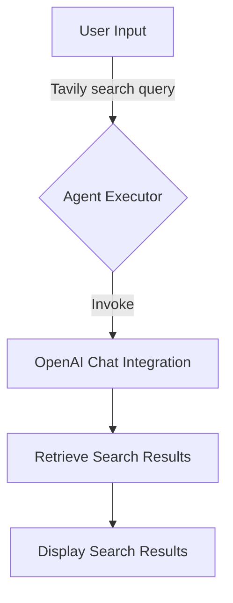

# Interactive Tavily Search Agent with OpenAI Chat Integration

## Objective
The objective of this code is to create an interactive Tavily search agent that integrates with OpenAI Chat. The agent uses the Tavily search tool to provide search results based on user input.

## Summary of the Objective:
- Create an interactive Tavily search agent.
- Integrate the agent with OpenAI Chat to provide search results.

## Medium tutorial:
[Click here](https://patotricks15.medium.com/building-a-smart-search-agent-with-langchain-and-tavily-search-6838076e35f1)

# Flowchart

