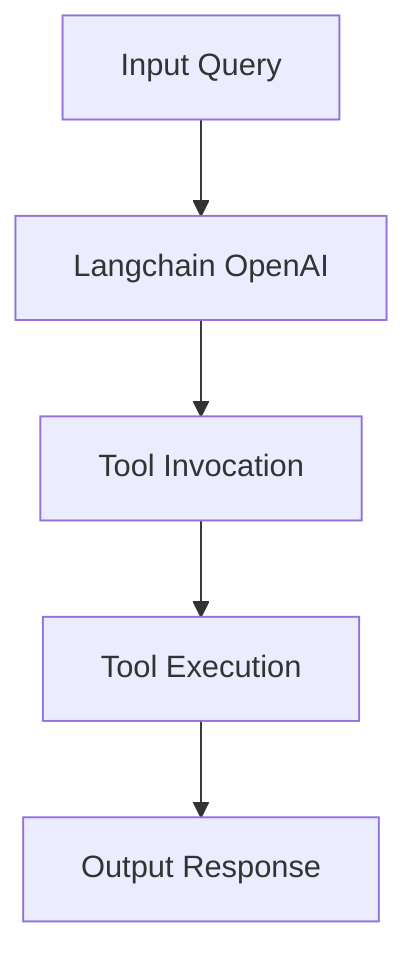

# Python ChatOpenAI with Mathematical Tools

## Objective
The objective of this code is to demonstrate the integration of the Langchain OpenAI module with mathematical tools for performing arithmetic operations.

## Summary of the Objective:
- Integrate Langchain OpenAI module with mathematical tools
- Perform arithmetic operations using the integrated tools

# Flowchart
