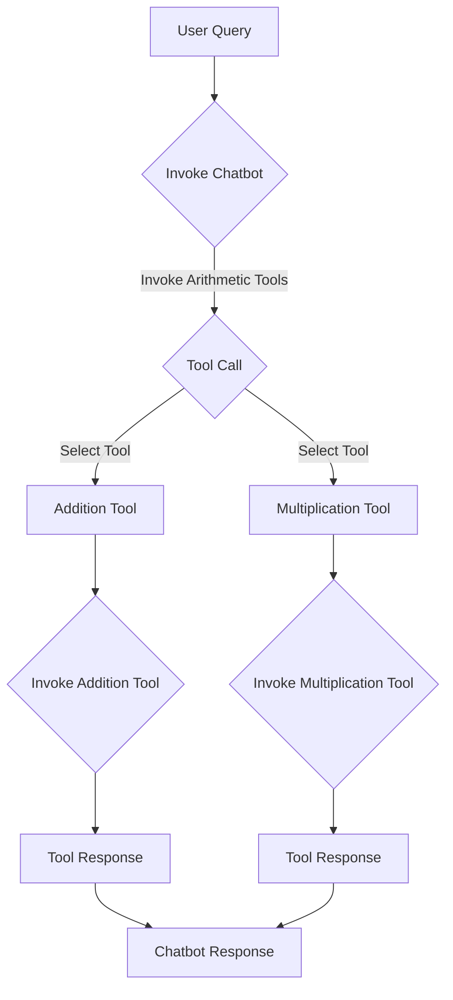

# "Python Chatbot with Arithmetic Tools"

## Objective
The objective of this Python code is to create a chatbot using the langchain_openai library and implement arithmetic tools for addition and multiplication. The chatbot will be able to answer arithmetic queries using the implemented tools.

## Summary of the Objective:
- Create a chatbot using the langchain_openai library.
- Implement arithmetic tools for addition and multiplication.

# Flowchart

The README has been generated based on the provided Python code.