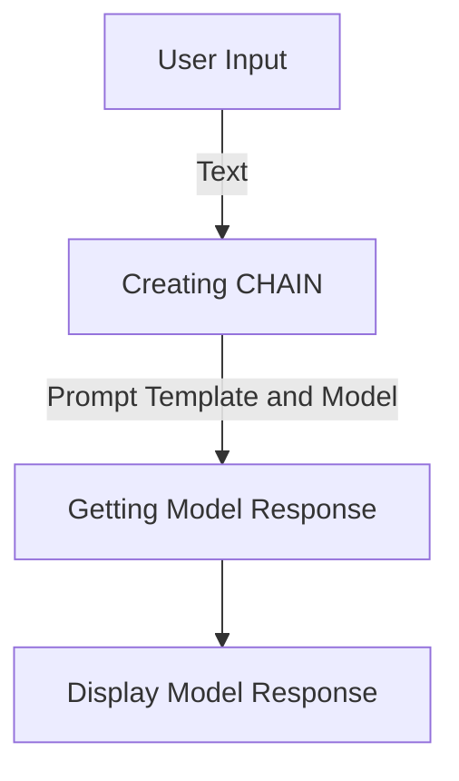

# "Multilingual Text Translation with OpenAI Chat"

## Objective
The objective of this code is to demonstrate the use of the OpenAI Chat API for multilingual text translation.

## Summary of the Objective:
- Set up the configuration for the OpenAI Chat API.
- Create a prompt template for translating text into different languages.

# Flowchart
