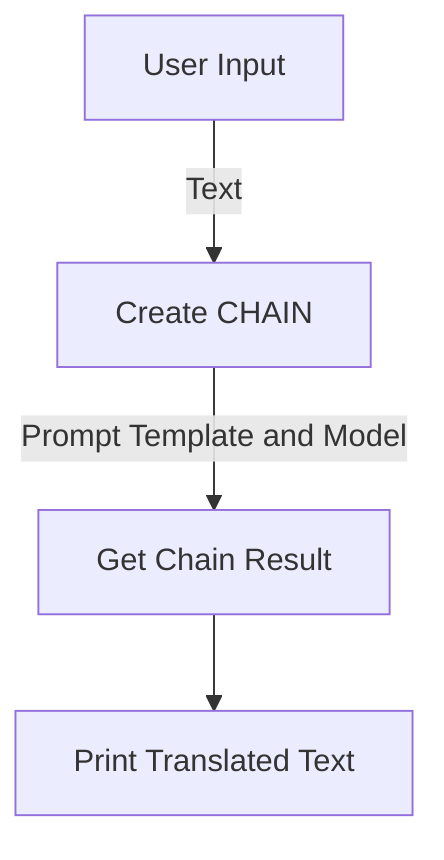

# Multilingual Text Translation with OpenAI Chat

## Objective
The objective of this code is to translate text into a specified language using the OpenAI Chat model.

## Summary of the Objective:
- Set up the OpenAI Chat model for multilingual text translation.
- Prompt the user to input text and specify the target language for translation.

# Flowchart
