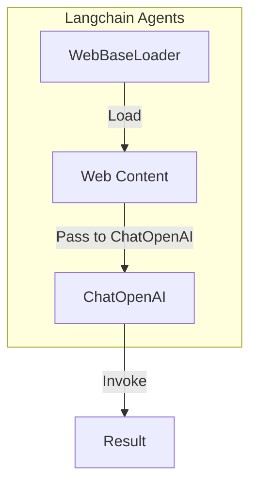

#  Safely Querying Enterprise Data with Langchain Agents - AI Chatbot Implementation"

## Objective
The objective of this code is to demonstrate how to safely query enterprise data using Langchain agents and an AI chatbot implementation.

## Summary of the Objective:
- Use Langchain agents to safely query enterprise data
- Implement an AI chatbot for interacting with the Langchain agents

# Flowchart
