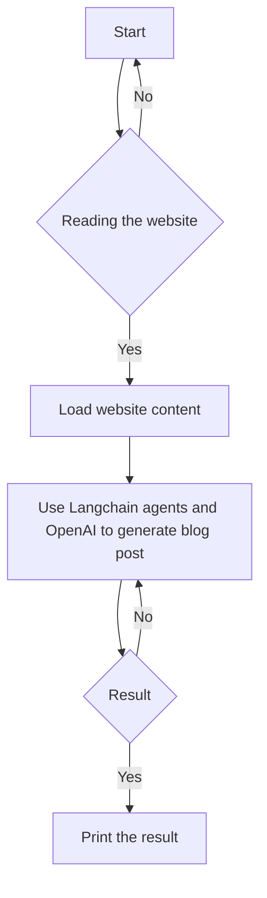

#  Safely Querying Enterprise Data with Langchain Agents - AI-Powered Blog Post Generation

## Objective
The objective of this code is to use Langchain agents and OpenAI to generate a blog post on the topic of "Safely Querying Enterprise Data".

## Summary of the Objective:
- Use Langchain agents to safely query enterprise data
- Generate a blog post using OpenAI and Langchain agents

# Flowchart

The Python code uses Langchain's document loaders to load content from a website and then uses Langchain agents and OpenAI to generate a blog post on the topic of "Safely Querying Enterprise Data". The result is then printed.