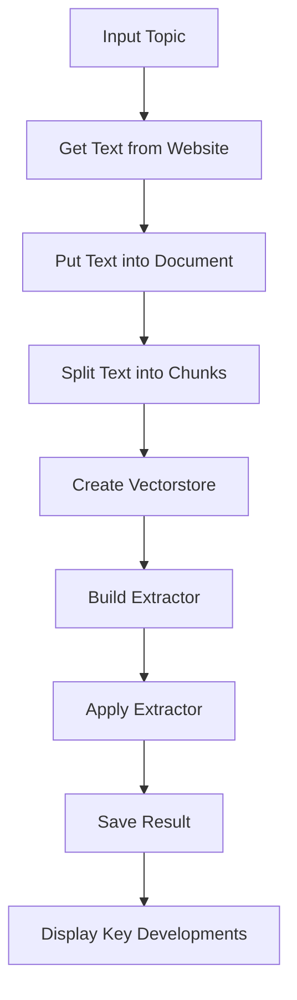

# Python Code for Extracting Key Historic Developments from Text

## Objective
The objective of this code is to extract key historic developments from a given text related to a specific topic.

## Summary of the Objective:
- Extract important historic developments from the provided text.
- Organize the extracted developments based on their year or century.

# Flowchart

The Python code uses various libraries and modules to achieve the objective. It starts by taking a user input for the topic and then extracts text from a Wikipedia page related to the input topic. The extracted text is then split into chunks, and a vectorstore is created. The code then builds an extractor, applies the extractor to the text chunks, saves the extracted results, and finally displays the key developments.

The code utilizes classes and models to define the structure of the extracted data and uses a prompt to guide the extraction process. The extracted key developments are sorted based on their year or century and then displayed.

The code follows a structured approach to extract and organize key historic developments from the provided text.