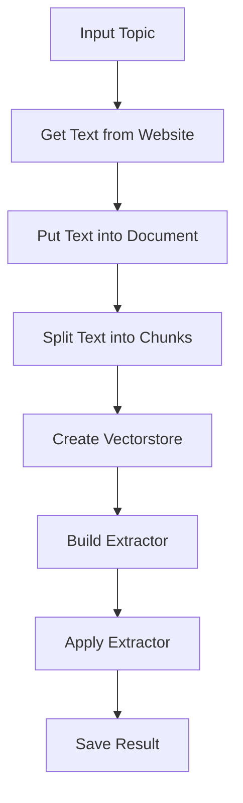

# Text Extraction and Key Development Identification from Historical Documents

## Objective

The objective of this code is to extract key historical developments from a given historical document related to a specific topic. The code uses language processing and machine learning techniques to identify and extract important historical information from the text.

## Summary of the Objective:

- Extract key historical developments from the provided historical document.
- Use language processing and machine learning to identify and extract important historical information.

# Flowchart
