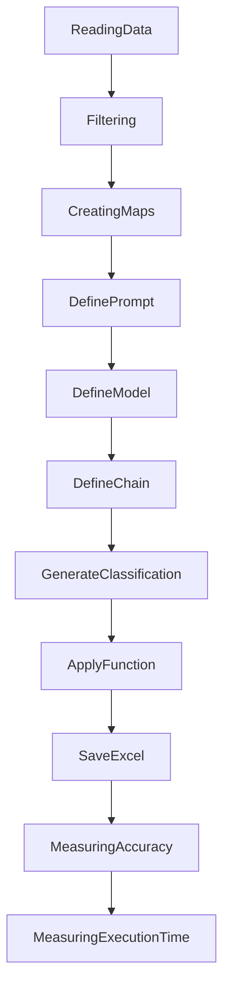

# Financial News Sentiment Analysis with GPT-4o-mini Model

## Objective
The objective of this code is to perform sentiment analysis on financial news using the GPT-4o-mini model. The sentiment analysis involves classifying the financial news into bearish, bullish, or neutral categories and providing an explanation for the chosen sentiment.

## Summary of the Objective:
- Read financial news data from a CSV file.
- Preprocess the data and create maps for labels.
- Use the GPT-4o-mini model to classify the financial news sentiment and generate explanations.
- Measure the accuracy of the sentiment analysis.
- Save the results to an Excel file.

# Flowchart

The code begins by reading financial news data from a CSV file and then filters the data to reduce execution time. It creates maps for labels and uses the GPT-4o-mini model to classify the financial news sentiment and generate explanations. The accuracy of the sentiment analysis is measured, and the results are saved to an Excel file. Finally, the execution time is measured.

The README has been generated from the provided Python code.